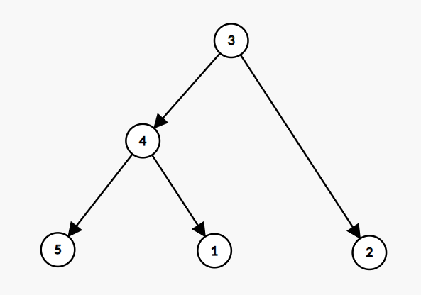

# Цепочки скриптов

### Интерфейс ButtonInfoOptions<a name="ButtonInfoOptions"></a>
```ts
interface ButtonInfoOptions {
	setLabel(label: string): ButtonInfoOptions;
	setStyle(style: string): ButtonInfoOptions;
}
```
Интерфейс настроек кнопки. Все функции возвращают `this`.

&nbsp;

```js
setLabel(label: string): ButtonInfoOptions
```
Устанавливает текст кнопки.

&nbsp;

```js
setStyle(style: string): ButtonInfoOptions
```
Устанавливает стиль кнопки. Возможные значения: `'PRIMARY'` – кнопка цвета темы Optimacros, `'SECONDARY'` – скучная, неинтересная кнопка. Значение по умолчанию: `'PRIMARY'`.

&nbsp;

### Интерфейс ButtonInfo<a name="ButtonInfo"></a>
```ts
interface ButtonInfo {
	setType(type: string): ButtonInfo;
	options(): ButtonInfoOptions;
}
```
Интерфейс информации о кнопке.

&nbsp;

```js
setType(type: string): ButtonInfo
```
Устанавливает тип кнопки. Возможные значения: `'GENERAL'` – подтверждение действия, `'CLOSE'` – отмена действия (в этом случае после завершения скрипта обе кнопки в интерфейсе Optimacros будут кнопками отмены). Значение по умолчанию: `'GENERAL'`. Возвращает `this`.

&nbsp;
	
```js
options(): ButtonInfoOptions
```
Возвращает интерфейс [`ButtonInfoOptions`](#ButtonInfoOptions) настроек кнопки.

&nbsp;

### Интерфейс EnvironmentInfo<a name="EnvironmentInfo"></a>
```ts
interface EnvironmentInfo {
	set(key: string, value: any): EnvironmentInfo;
	get(key: string): any;
}
```
Интерфейс [`переменных окружения`](https://ru.wikipedia.org/wiki/%D0%9F%D0%B5%D1%80%D0%B5%D0%BC%D0%B5%D0%BD%D0%BD%D0%B0%D1%8F_%D1%81%D1%80%D0%B5%D0%B4%D1%8B). Значениями могут быть только [`сериализуемые`](https://developer.mozilla.org/ru/docs/Web/JavaScript/Reference/Global_Objects/JSON/stringify) в JSON данные.

&nbsp;

```js
set(key: string, value: any): EnvironmentInfo
```
Устанавливает переменной `key` значение `value`. Возвращает `this`.

&nbsp;

```js
get(key: string): any
```
Возвращает значение переменной `key`.

&nbsp;

### Интерфейс ResultBaseAction<a name="ResultBaseAction"></a>
```ts
interface ResultBaseAction {
	appendAfter(): this;
	setModelId(modelId: string): this;
}
```
Базовый интерфейс действия.

&nbsp;

```js
appendAfter(): this
```
Добавляет действие в реестр последующего запуска. Оно будет выполнено после исполнения текущего скрипта. При этом если действием является запуск очередного скрипта [`ResultMacrosAction`](#ResultMacrosAction), который в свою очередь тоже может добавить в реестр действие запуска некоторого количества скриптов, то функционирование реестра запуска осуществляется в соответствии с алгоритмом обхода дерева запусков [`в глубину`](https://ru.wikipedia.org/wiki/%D0%9F%D0%BE%D0%B8%D1%81%D0%BA_%D0%B2_%D0%B3%D0%BB%D1%83%D0%B1%D0%B8%D0%BD%D1%83).

Рассмотрим пример. Скрипт `3` последовательно добавляет действия запусков скриптов `4` и `2`. Скрипт `4` последовательно добавляет действия запусков скриптов `5` и `1`:



В такой ситуации скрипты исполнятся в следующем порядке: `3 -> 4 -> 5 -> 1 -> 2`.

&nbsp;

```js
setModelId(modelId: string): this
```
Устанавливает имя или `id` модели, к которой будет относиться выполнение действия. Этот механизм позволяет запустить скрипт из другой модели.

&nbsp;

### Интерфейс ResultMacrosAction<a name="ResultMacrosAction"></a>
```ts
interface ResultMacrosAction extends ResultBaseAction {
	setAutoRunTimeout(seconds: number): this;
	buttonInfo(): ButtonInfo;
	environmentInfo(): EnvironmentInfo;
}
```
Интерфейс действия запуска скрипта.Наследуется от [`ResultBaseAction`](#ResultBaseAction).

&nbsp;

```js
setAutoRunTimeout(seconds: number): this
```
Устанавливает тайм-аут запуска скрипта в секундах. Значение по умолчанию: `0`. Если задан ненулевой тайм-аут, дальнейшие действия зависят от факта вызова функции `buttonInfo()`.

Если `buttonInfo()` *не* была вызвана, после исполнения текущего скрипта произойдёт ожидание заданного тайм-аута и запустится следующий скрипт, однако результат вывода текущего скрипта на экране не отобразится.

Если `buttonInfo()` была вызвана, после исполнения текущего скрипта на экране отобразится его вывод и кнопки, указанные в описании этой функции. При этом на кнопке [`ButtonInfo`](#ButtonInfo) будет располагаться таймер обратного отсчёта заданного тайм-аута. Если пользователь не произведёт за это время действий, автомагически будет нажата эта кнопка.

Возвращает `this`.

&nbsp;

<a name="ResultMacrosAction.buttonInfo"></a>
```js
buttonInfo(): ButtonInfo
```
В случае вызова этой функции после завершения работы скрипта в интерфейсе Optimacros появятся 2 кнопки: `Отмена`, которая отменяет запуск действия, и кнопка, чьи вид и поведение определяются интерфейсом [`ButtonInfo`](#ButtonInfo), который и возвращает функция.

&nbsp;

```js
environmentInfo(): EnvironmentInfo
```
Возвращает интерфейс [`EnvironmentInfo`](#EnvironmentInfo) для передачи [`переменных окружения`](https://ru.wikipedia.org/wiki/%D0%9F%D0%B5%D1%80%D0%B5%D0%BC%D0%B5%D0%BD%D0%BD%D0%B0%D1%8F_%D1%81%D1%80%D0%B5%D0%B4%D1%8B) скрипту.

&nbsp;

### Интерфейс ResultOpenAction<a name="ResultOpenAction"></a>
```ts
interface ResultOpenAction extends ResultBaseAction {
	buttonInfo(): ButtonInfo;
}
```
Интерфейс действия открытия некоторого объекта Optimacros. Наследуется от [`ResultBaseAction`](#ResultBaseAction).

&nbsp;

```js
buttonInfo(): ButtonInfo
```
Работает так же, как и [`ResultMacrosAction`](#ResultMacrosAction).[`buttonInfo()`](#ResultMacrosAction.buttonInfo).

&nbsp;

### Интерфейс ResultActionsInfo<a name="ResultActionsInfo"></a>
```ts
interface ResultActionsInfo {
	makeMacrosAction(identifier: string | number): ResultMacrosAction;
	makeDashboardOpenAction(identifier: string | number): ResultOpenAction;
	makeContextTableOpenAction(identifier: string | number): ResultOpenAction;
	makeMulticubeViewOpenAction(multicube: string | number, view?: string | number | null): ResultOpenAction;
	makeListViewOpenAction(list: string | number, view?: string | number | null): ResultOpenAction;
}
```
Интерфейс создания действий, которые можно автомагически осуществить после исполнения текущего скрипта.

&nbsp;

```js
makeMacrosAction(identifier: string | number): ResultMacrosAction
```
Создаёт и возвращает действие [`ResultMacrosAction`](#ResultMacrosAction) запуска существущего в модели скрипта. Аргумент `identifier` означает имя или [`longId`](./views.md#longId) скрипта.

&nbsp;

```js
makeDashboardOpenAction(identifier: string | number): ResultOpenAction
```
Создаёт и возвращает действие [`ResultOpenAction`](#ResultOpenAction) открытия существущего в модели дашборда. Аргумент `identifier` означает имя или [`longId`](./views.md#longId) дашборда.

&nbsp;

```js
makeContextTableOpenAction(identifier: string | number): ResultOpenAction
```
Создаёт и возвращает действие [`ResultOpenAction`](#ResultOpenAction) открытия существущей в модели контекстной таблицы. Аргумент `identifier` означает имя или [`longId`](./views.md#longId) контекстной таблицы.

&nbsp;

```js
makeMulticubeViewOpenAction(multicube: string | number, view?: string | number | null): ResultOpenAction
```
Создаёт и возвращает действие [`ResultOpenAction`](#ResultOpenAction) открытия существущего в модели мультикуба. Аргумент `identifier` означает имя или [`longId`](./views.md#longId) мультикуба, `view` означает имя или [`longId`](./views.md#longId) представления.

&nbsp;

```js
makeListViewOpenAction(list: string | number, view?: string | number | null): ResultOpenAction
```
Создаёт и возвращает действие [`ResultOpenAction`](#ResultOpenAction) открытия существущего в модели справочника. Аргумент `identifier` означает имя или [`longId`](./views.md#longId) справочника, `view` означает имя или [`longId`](./views.md#longId) представления.

&nbsp;

[API Reference](API.md)

[Оглавление](../README.md)
