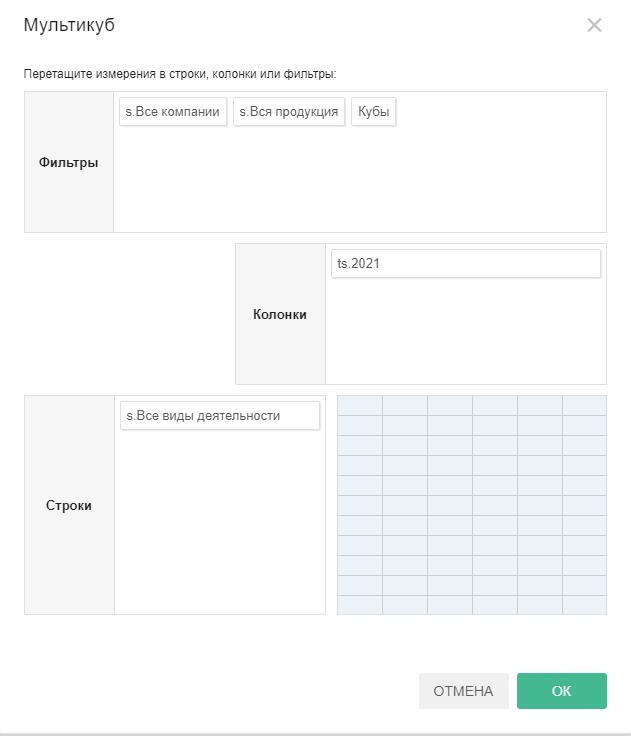
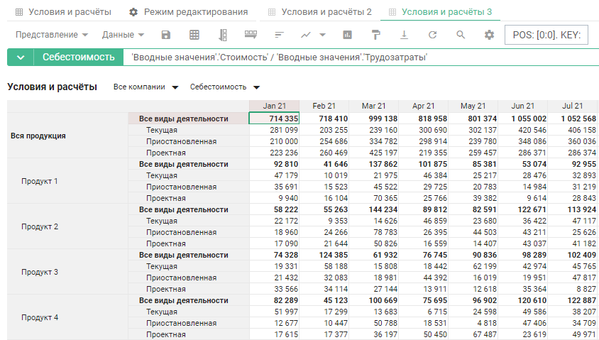
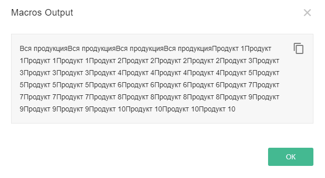
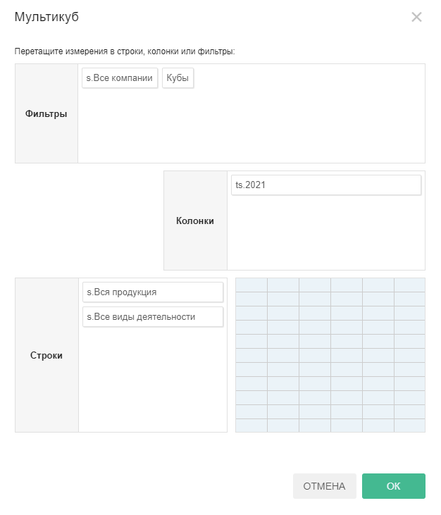
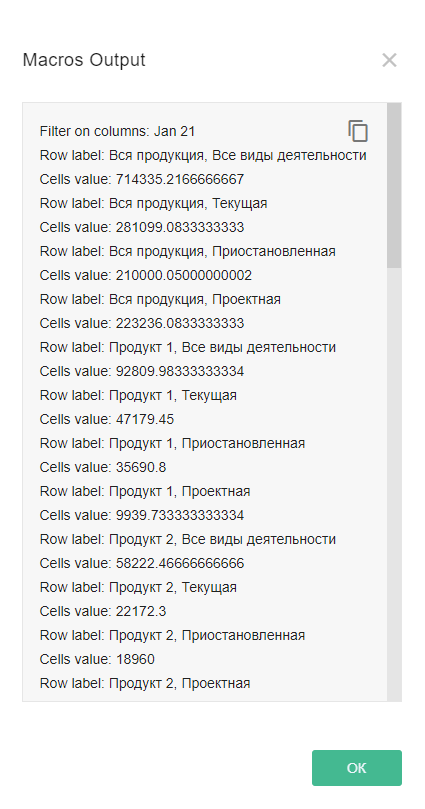

# Способы доступа к ячейкам

## Доступ к заголовкам строк

Для получения наименований заголовков строк необходимо обратиться к таблице представления мультикуба и последовательно перебрать каждое наименование строки таблицы.

По аналогии с предыдущим уроком для получения доступа к ячейкам представления мультикуба необходимо открыть раздел мультикубов, выбрать один из доступных, указать необходимое представление и обратиться к таблице с данными:

```js
const multicubesTab = om.multicubes.multicubesTab();
const multicubeTab = multicubesTab.open('Условия и расчёты');

const pivot = multicubeTab.pivot('Условия и расчёты 3');
const grid = pivot.create();

const range = grid.range();
const generator = range.generator();
```

Для получения данных из таблицы представления мультикуба используется функция `range()` интерфейса [Grid](../API/views.md#Grid). Она выбирает прямоугольник представления мультикуба, и если не передавать в неё аргументы, то будет захватывать всю таблицу.

На данном этапе ещё нет запроса доступа данных к указанному диапазону, и переменная `range` не содержит в себе значений клеток. Чтобы их получить, необходимо вызвать функцию-генератор – `generator()` – интерфейса [GridRange](../API/views.md#GridRange). Т. к. среда Оptimacros расчитана на работу с объектами, содержащими большие объёмы данных, запрос на получение этих данных реализован покусочно. Функция-генератор возвращает куски [GridRangeChunk](../API/views.md#GridRangeChunk) представления таблицы, с которыми можно работать в цикле.

В зависимости от представления (количества измерений в строках) логика получения данных заголовков строк будет разной. Разберём два случая. Первый, когда в измерениях строк одно измерение, и второй, когда измерений несколько.

### Одно измерение в строках

Настройки сводной таблицы отображения мультикуба:



Представление таблицы мультикуба:



Функция `rows()`, вызванная на куске [`chunk`](../API/views.md#GridRangeChunk) диапазона, который мы указали в переменной `range`, позволяет получить доступ к заголовкам строк. Для получения полного массива заголовков строк в представлении вызываем функцию `all()` интерфейса [Labels](../API/views.md#Labels) и перебираем элементы полученного массива данных с помощью [`forEach()`](https://developer.mozilla.org/ru/docs/Web/JavaScript/Reference/Global_Objects/Array/forEach).

При переборе элементов задаём аргумент `labelsGroup` функции `forEach`, вызываем функцию `first()` интерфейса [LabelsGroup](../API/views.md#LabelsGroup), которая возвращает заголовки строк из полученного массива заголовков представления, и функцию `label()` интерфейса [EntityInfo](../API/views.md#EntityInfo), она вернёт наименования заголовков:

```js
for (const chunk of generator) {
    chunk.rows().all().forEach(labelsGroup => {
        console.log(labelsGroup.first().label());
    });
}
```

Если теперь вывести данные в консоль, то увидим склеенные в одну строку заголовки. Дело в том, что движок скриптов 1.0 [не переносит курсор](../appendix/constraints.md#noLineBreak) на следующую строку после работы функции `console.log()`:



Для удобства отображения добавим его самостоятельно:

```js
for (const chunk of generator) {
    chunk.rows().all().forEach(labelsGroup => {
        console.log(`Row label: ${labelsGroup.first().label()} \n`);
    });
}
```

Итоговый код:

```js
const multicubesTab = om.multicubes.multicubesTab();
const multicubeTab = multicubesTab.open('Условия и расчёты');

const pivot = multicubeTab.pivot('Условия и расчёты 3');
const grid =  pivot.create();

const range = grid.range();
const generator = range.generator();

for (const chunk of generator) {
    chunk.rows().all().forEach(labelsGroup => {
        console.log(`Row label: ${labelsGroup.first().label()} \n`);
    });
}
```

Как результат получаем полный список заголовков строк: 


### Несколько измерений в строках

Настройки сводной таблицы отображения мультикуба:



Представление таблицы мультикуба:


Заменим функцию `first()` на функцию `all()` (это приведёт к получению массива данных заголовков всех уровней). Чтобы получить данные вида `Заголовок 1 уровня, Заголовок 2 уровня, ...`, нужно перебирать элементы массива заголовков каждого уровня (в данном случае до второго) с помощью функции массивов [`forEach()`](https://developer.mozilla.org/ru/docs/Web/JavaScript/Reference/Global_Objects/Array/forEach).

Создадим массив `rowLabels` для хранения наименований заголовков и будем добавлять в него полученные значения. Далее значение массива выводим в консоль, указывая резделитель заголовков `', '` с помощью функции объединения массивов [`join()`](https://developer.mozilla.org/ru/docs/Web/JavaScript/Reference/Global_Objects/Array/join):

```js
for (const chunk of generator) {
    chunk.rows().all().forEach(labelsGroup => {
        const rowLabels = [];
        labelsGroup.all().forEach(label => {
            rowLabels.push(label.label());
        });
		
        console.log(`Row label: ${rowLabels.join(', ')} \n`);
    });
}
```

Итоговый код:

```js
const multicubesTab = om.multicubes.multicubesTab();
const multicubeTab = multicubesTab.open('Условия и расчёты');

const pivot = multicubeTab.pivot('Условия и расчёты 3');
const grid =  pivot.create();

const range = grid.range();
const generator = range.generator();

for (const chunk of generator) {
    chunk.rows().all().forEach(labelsGroup => {
        const rowLabels = [];
        labelsGroup.all().forEach(labels => {
            rowLabels.push(labels.label());
        });
				
        console.log(`Row label: ${rowLabels.join(', ')} \n`);
    });
}
```

В результате работы скрипта получим полный список двух уровней заголовков представления мультикуба:


## Доступ к значениям клеток

Чтобы получить значения, которые находятся в клетках таблицы представления мультикуба, как и со строками, для начала необходимо обратиться к таблице представления и последовательно вывести данные ячеек.

### Доступ ко всем значениям

Для получения доступа к значениям клеток используется интерфейс [Cell](../API/views.md#Cell). Функции интерфейса позволяют считывать и изменять значения клеток. Для получения значений хранящихся в ячейках вызывается функция `getValue()`. В массив `cellValues` будем сохранять полученные функцией `getValue()` значения. Итоговый код:

```js
const multicubesTab = om.multicubes.multicubesTab();
const multicubeTab = multicubesTab.open('Условия и расчёты');

const pivot = multicubeTab.pivot('Условия и расчёты 3');
const grid =  pivot.create();

const range = grid.range();
const generator = range.generator();

for (const chunk of generator) {
    chunk.rows().all().forEach(labelsGroup => {
        const rowLabels = [];
        labelsGroup.all().forEach(labels => {
            rowLabels.push(labels.label());
        });
        console.log(`Row label: ${rowLabels.join(', ')} \n`);
				
        const cellValues = [];
        labelsGroup.cells().all().forEach(cell => {
            cellValues.push(cell.getValue());
        });
        console.log(`Cells value: ${cellValues.join(', ')} \n \n`);
    });
}
```


### Доступ к значениям определённого столбца с помощью фильтра

Если нас интересуют значения только в одном столбце и не планируется считывать данные из других, то одним из вариантов написания кода будет вызов функции `columnsFilter()` интерфейса [Pivot](../API/views.md#Pivot). Создадим переменную `monthFilter`, зададим ей значение из необходимого столбца, например, `'Jan 21'`, и передадим её в функцию:

```js
const pivot = multicubeTab.pivot('Условия и расчёты 3');
const monthFilter = 'Jan 21';
const grid =  pivot.columnsFilter(monthFilter).create();

const range = grid.range();
const generator = range.generator();

console.log(`Filter on columns: ${monthFilter} \n`);
```

Т. к. в результате работы скрипта будут получены значения только одного столбца, массив `cellValues` можно не использовать.

Итоговый код:

```js
const multicubesTab = om.multicubes.multicubesTab();
const multicubeTab = multicubesTab.open('Условия и расчёты');

const pivot = multicubeTab.pivot('Условия и расчёты 3');
const monthFilter = 'Jan 21';
const grid =  pivot.columnsFilter(monthFilter).create();

const range = grid.range();
const generator = range.generator();

console.log(`Filter on columns: ${monthFilter} \n`);

for (const chunk of generator) {
    chunk.rows().all().forEach(labelsGroup => {
        const rowLabels = [];
        labelsGroup.all().forEach(labels => {
            rowLabels.push(labels.label());
        });
				
        console.log(`Row label: ${rowLabels.join(', ')} \n`);
        labelsGroup.cells().all().forEach(cell => {
            console.log(`Cells value: ${cell.getValue()} \n`);
        });
    });
}
```



[Курс молодого бойца](cookBook.md)

[Оглавление](../README.md)
