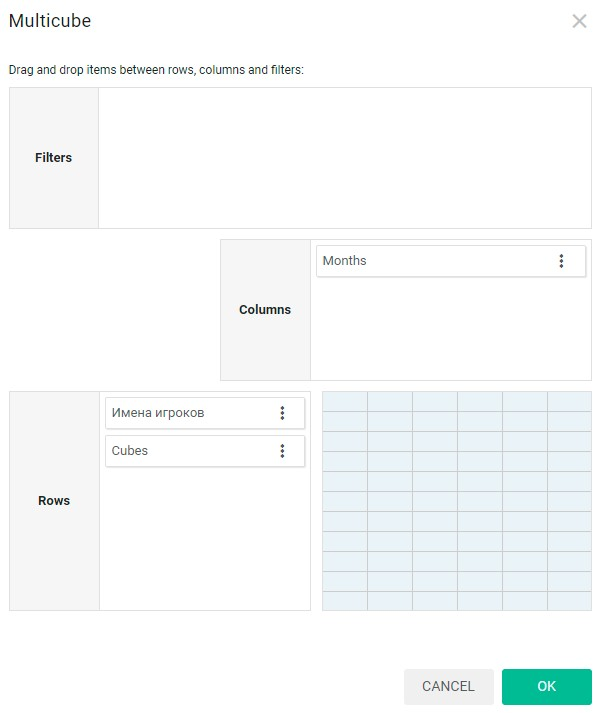
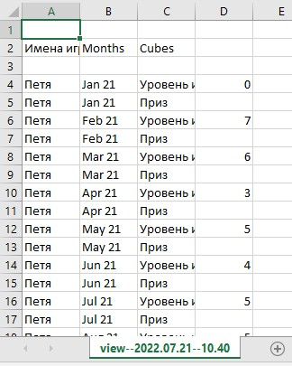
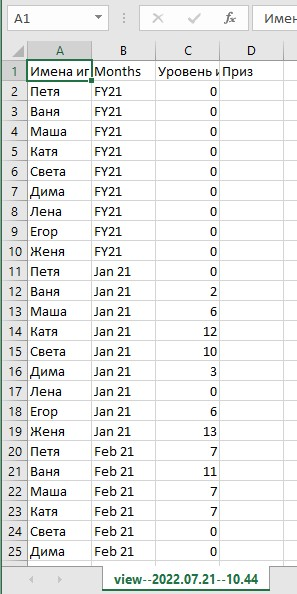

# CSV
# Экспорт и импорт из мультикуба в csv
Обычный метод модификации данных мультикуба использует функцию ```generator()``` интерфейса `GridRange`. Получаем интерфейс `GridRangeChunk`, который построчно читается. Модифицируем необходимые строки, записываем изменения в буфер и передаем значения на сервер. Основной недостаток этого метода - очень медленная работа при большом размере мультикуба. Как показала практика, гораздо быстрее с этой задачей справляется метод, использующий модифицирование данных через csv файлы. Именно об этом методе пойдет речь далее. Алгоритм метода включает в себя 4 пункта: выгрузку данных в файл, чтение и модификацию, запись в новый файл, импорт в мультикуб новых данных.

Система выгружает в csv данные только по текущему выбранному фильтру во вью. Если нужны все данные МК, то нужен плоский вид, если будут фильтры — то выгрузится всё только по выбранным фильтрам.

В качестве примера возможной задачи возьмем мультикуб нескольких игроков. В зависимости от уровня игрока зависит ценность получаемой награды. Наша задача - раздать игрокам их награды. Мультикуб называется "Уровни игроков". Внутри него 2 куба: "Приз" и "Уровень игрока". Также я добавил 2 справочника: "Months" и "Имена игроков". Если уровень игрока меньше или равен пятому, он получает "Меч третьего уровня", если больше пятого, уровень игрока становится равен случайному числу от 5 до 15 и получает "Меч Иссинхдора".


Сводная таблица мультикуба:



##  Экспорт из мультикуба в csv

Сначала необходимо получить доступ к данным мультикуба для которого осуществляется экспорт. 

По аналогии с [одним из предыдущих уроков](./rowsColumnsFilters.md) для получения доступа к ячейкам представления мультикуба необходимо открыть раздел мультикубов, выбрать один из доступных, указать необходимое представление и обратиться к таблице с данными:
```js
const multicubesTab = om.multicubes.multicubesTab();
const multicubeTab = multicubesTab.open("Уровни игроков");

const pivot = multicubeTab.pivot();
const grid = pivot.create();
```
Теперь нам нужен интерфейс экспорта таблицы. Существует интерфейс [Exporter](../API/exportImport.md#Exporter) базового экспорта таблицы и интерфейс [StorageExporter](../API/exportImport.md#StorageExporter) быстрого экспорта таблицы. Рассмотрим их различия. Интерфейс `StorageExporter` наследуется от `Exporter`. Доступен только в мультикубах. В отличие от базового, формат выгрузки фиксирован и отличается от представления таблицы: в столбцах находятся измерения и кубы. Кроме того, вместо псевдонимов (отображаемых имен) экспортируются только их имена. По умолчанию обычный экспорт, если есть псевдонимы, выводит псевдоним или имя как в справочнике.

На практике рассмотрим отличия в csv файлах. Для этого сначала сохраним экспортированные файлы по локальным путям и скачаем их.  

Получим доступ к интерфейсу быстрого экспорта таблицы `StorageExporter` с помощью функции `storageExporter()`. Устанавливаем формат экспортируемого файла csv, используя функцию `setFormat`. Для чтения файла в нужной кодировке используем функцию `setEncoding`. Будьте осторожны с изменением кодировки файла. Так как кодировка файла поменялась, необходимо будет указать новую кодировку при чтении csv.

Производим экспорт файла в соответствии с настройками с помощью функции `export()` и получаем ссылку на интерфейс [ExportResult](../API/exportImport.md#ExportResult). Сохраним экспортированный файл по пути `storageExporter` с помощью функции `copyToLocal()` для последующего доступа по сохраненному пути.
```js
const storageExporter = grid.storageExporter().setFormat("csv").setEncoding("WINDOWS-1251");
const storageExportResult = storageExporter.export().copyToLocal("storageExporter"); 
```
Получим доступ к интерфейсу базового экспорта таблицы `Exporter` с помощью функции `exporter()`. Устанавливаем формат экспортируемого файла csv, используя функцию `setFormat`. Для чтения файла в нужной кодировке используем функцию `setEncoding()`.

Производим экспорт файла в соответствии с настройками с помощью функции `export()` и получаем ссылку на интерфейс `ExportResult`. Сохраним экспортированный файл по пути `Exporter` с помощью функции `copyToLocal()` для последующего доступа по сохраненному пути.
```js
const exporter = grid.exporter().setFormat("csv").setEncoding("WINDOWS-1251");
const exportResult = exporter.export().copyToLocal("export"); 
```
Для скачивания файлов необходимо получить идентификатор файла в глобальном реестре, чтобы передать его в функцию `ResultInfo.addFileHash()`, используя интерфейс [ResultInfo](../API/common.md#ResultInfo). Чтобы получить идентификатор воспользуемся функцией `getHash()` интерфейса `ExportResult`. Функция `addFileHash()` скачивает файл в браузере.
```js
const hashStorageExport = storageExportResult.getHash();
const hashExport = exportResult.getHash();
const resultInfo = om.common.resultInfo();

resultInfo.addFileHash(hashStorageExport);
resultInfo.addFileHash(hashExport);
```
Для скачивания нескольких файлов нужно в браузере разрешить скачивание нескольких файлов. Или скачиваем файлы по очереди.
Итоговый код:
```js
const multicubesTab = om.multicubes.multicubesTab();
const multicubeTab = multicubesTab.open("Уровни игроков");

const pivot = multicubeTab.pivot();
const grid = pivot.create();

const storageExporter = grid.storageExporter().setFormat("csv").setEncoding("WINDOWS-1251");
const storageExportResult = storageExporter.export().copyToLocal("storageExporter"); 
const exporter = grid.exporter().setFormat("csv").setEncoding("WINDOWS-1251");
const exportResult = exporter.export().copyToLocal("export"); 

const hashStorageExport = storageExportResult.getHash();
const hashExport = exportResult.getHash();
const resultInfo = om.common.resultInfo();

resultInfo.addFileHash(hashStorageExport);
resultInfo.addFileHash(hashExport);
```
Файл базового экспорта:



Файл быстрого экспорта:



Обычный формат экспорта выдаёт первой строкой — выбранные фильтры, далее — сначала перечисление измерений в строках, потом перечисление измерений в колонках.
Потом идут строки с заголовками столбцов (по числу измерений), при этом ячейки, соответствующие заголовкам строк пустые. Потом идут строки как во вью.
Общее правило такое: обычная выгрузка выдаёт вью, как оно есть в модели, быстрая выгрузка выводит все в виде столбцов.
Я выбрал интерфейс StorageExporter из-за его сильного удобства. За одну строку мы сразу считаем значения всех кубов мультикуба. Это позволяет просто запомнить индексы соответствующих кубов и обращаться к ним в массиве. Во втором случае при большом количестве кубов проблематично однозначно идентифицировать имя куба с его значением. К тому же, если потребуется получить несколько значений кубов одновременно, придется вручную запоминать каждое из них в переменную, что не очень удобно. Случай работы с интерфейсом `Exporter` в этом уроке описан не будет.

Итоговый код:
```js
const multicubesTab = om.multicubes.multicubesTab();
const multicubeTab = multicubesTab.open("Уровни игроков");

const pivot = multicubeTab.pivot();
const grid = pivot.create();

const storageExporter = this.grid.storageExporter().setFormat("csv");
const exportResult = storageExporter.export().copyToLocal("export"); 
```

##  Чтение csv и модификация
Теперь можно построчно читать данные входного мультикуба. 
Получаем доступ к интерфейсу локальной файловой системы [Filesystem](../API/fs.md#Filesystem) с помощью функции `getPathObj()`, в качестве параметра передается путь файла `export`. Этот интерфейс хранит в себе путь к файлу и ссылку на файловую систему. Он понадобится для чтения файла по выбранному пути.

Получим интерфейс [FilesDataManager](../API/csv.md#FilesDataManager) для чтения файла с помощью функции `csvReader()`, в качестве параметра укажем интерфейс PathObj. Не забываем, что кодировка сохраненного файла изменилась на "WINDOWS-1251", поэтому изменяем настройки интерфейса `CsvReader`. Для этого вызываем функцию `changeFileCharset` с параметром "WINDOWS-1251". Чтобы прочитать файл построчно вызовем  функцию-генератор – `generator()` – интерфейса `CsvReader` возвращающую массив строк вида `string[][]`.
```js
const localFileSystem = om.filesystems.local();
const filePath = localFileSystem.getPathObj("export");
const fileManager = om.filesystems.filesDataManager();
const csvReader = fileManager.csvReader(filePath)
                             .changeFileCharset("WINDOWS-1251");
const generator = csvReader.generator();
```
Итоговый код:
```js
const multicubesTab = om.multicubes.multicubesTab();
const multicubeTab = multicubesTab.open("Уровни игроков");

const pivot = multicubeTab.pivot();
const grid = pivot.create();

const storageExporter = grid.storageExporter().setFormat("csv").setEncoding("WINDOWS-1251");
const exportResult = storageExporter.export().copyToLocal("export"); 

const localFileSystem = om.filesystems.local();
const filePath = localFileSystem.getPathObj("export");
const fileManager = om.filesystems.filesDataManager();
const csvReader = fileManager.csvReader(filePath)
                             .changeFileCharset("WINDOWS-1251");
const generator = csvReader.generator();
```
Посмотрим на структуру файла импорта, скачанного в предыдущий раз. Сначала идут заголовки измерений, внизу прописаны их значения.
В первой строке файла слева направо читаем заголовки строк и столбцов. Дальше в строке прописаны названия всех кубов мультикуба. Мультикуб может содержать внутри себя очень много кубов. Модифицировать нам необходимо только несколько кубов, еще некоторое количество кубов нам необходимо прочитать.  Нам необходимо сохранить заголовки строк, столбов и их значения без изменений. Оставим названия тех кубов, которые нам нужны и поменяем их значения на необходимые.
Для того, чтобы прочитать столбцы и строки измерений в каждой строчке файла, определим количество используемых справочников и выборок. В задаче используются только 2 справочника "Months" и "Имена игроков". Эта часть перезаписываться не будет.
Также необходим объект, содержащий названия кубов, значения которых необходимо прочитать. По условию нам нужны оба значения кубов "Уровень игрока" и "Приз".
```js
const CUBES_MK = {
        cubePrize: "Приз",
        cubePoints: "Уровень игрока"
}
const dimensionsLength = 2;
```
Т. к. среда Оptimacros рассчитана на работу с объектами, содержащими большие объёмы данных, запрос на получение этих данных реализован покусочно. Функция-генератор возвращает строковый массив, с которым можно работать в цикле.
```js
for (let rowArray of generator) {
}
```

Сначала прочитаем первую строку. Используем индикатор `firstLaunch`, чтобы прочитать только её. Массив `row` будет содержать экспортируемую строку. Далее проходимся циклом по строке. Если индекс элемента не является названием куба, добавим элемент в массив `row` без изменений. Это проверяется условием, что индекс меньше длины всех измерений. Индексы столбцов логично просто хранить в отдельном словаре, специально для этого предназначенном. В качестве словаря выступает объект `indexMap`. В него запишем названия всех кубов, чтобы в дальнейшем получить доступ к ним по индексу. Наименования кубов хранятся в объекте `CUBES_MK` и записываются отдельно в конец строки.
```js
let firstLaunch = true;
let indexMap = {};

for (let rowArray of generator) {
    let row = [];
    
    if (firstLaunch) {
        rowArray.forEach((element,index) => {
            if (index < dimensionsLength) {
                row.push(element);
            }
            indexMap[element] = index;
        });
        row.push(CUBES_MK.cubePoints);
        row.push(CUBES_MK.cubePrize);
        firstLaunch = false;
    }
}
```
Мы успешно записали первую строку файла. В следующей строке без изменений записываем заголовки измерений. Добавим ветку `else`, это значит, что строка не является первой.
```js
for (let rowArray of generator) {
    let row = [];
    
    if (firstLaunch) {
        rowArray.forEach((element,index) => {
            if (index < dimensionsLength) {
                row.push(element);
            }
            indexMap[element] = index;
        });
        row.push(CUBES_MK.cubePoints);
        row.push(CUBES_MK.cubePrize);
        firstLaunch = false;
    }
    else {
        rowArray.forEach((element,index) => {
            if (index < dimensionsLength) {
                row.push(element);
            }
        });
    }
}
```
Далее изменяем кубы. Свойство объекта `indexMap[CUBES_MK.cubePoints]` содержит индекс куба 'Уровень игрока' в массиве `rowArray`. Обратимся по индексу к кубу и проверим, что он больше пяти. В зависимости от этого условия добавляем приз для игрока. Записываем в строку уровень и приз.
```js
for (let rowArray of generator) {
    let row = [];
    
    if (firstLaunch) {
        rowArray.forEach((element,index) => {
            if (index < dimensionsLength) {
                row.push(element);
            }
            headersFile.push(element);
        });
        const headers = Object.values(CUBES_MK.valueCubes);
        headers.forEach(header => {
            row.push(header);
        });
        writeIndexCubes();
        firstLaunch = false;
    }
    else {
        rowArray.forEach((element,index) => {
            if (index < dimensionsLength) {
                row.push(element);
            }
        });
        let points = rowArray[indexMap[CUBES_MK.cubePoints]];
        if (points > 5) {
            row.push(Math.round(Math.random() * 10) + 5);
            row.push("Меч Иссинхдора");
        }
        else {
            row.push(points);
            row.push( "Меч 3 уровня");
        }
    }
}
```

Итоговый код: 
```js
const CUBES_MK = {
        cubePrize: "Приз",
        cubePoints: "Уровень игрока"
};

const multicubesTab = om.multicubes.multicubesTab();
const multicubeTab = multicubesTab.open("Уровни игроков");

const pivot = multicubeTab.pivot();
const grid = pivot.create();

const storageExporter = grid.storageExporter().setFormat("csv").setEncoding("WINDOWS-1251");
const exportResult = storageExporter.export().copyToLocal("export"); 
const resultInfo = om.common.resultInfo();

const localFileSystem = om.filesystems.local();
const filePath = localFileSystem.getPathObj("export");
const fileManager = om.filesystems.filesDataManager();
const csvReader = fileManager.csvReader(filePath)
                             .changeFileCharset("WINDOWS-1251");
const generator = csvReader.generator();

const dimensionsLength = 2;
let firstLaunch = true;
let indexMap = {};

for (let rowArray of generator) {
    let row = [];
    
    if (firstLaunch) {
        rowArray.forEach((element,index) => {
            if (index < dimensionsLength) {
                row.push(element);
            }

            indexMap[element] = index;
        });
        row.push(CUBES_MK.cubePoints);
        row.push(CUBES_MK.cubePrize);
        firstLaunch = false;
    }
    else {
        rowArray.forEach((element,index) => {
            if (index < dimensionsLength) {
                row.push(element);
            }
        });
        let points = rowArray[indexMap[CUBES_MK.cubePoints]];
        if (points > 5) {
            row.push(Math.round(Math.random() * 10) + 5);
            row.push("Меч Иссинхдора");
        }
        else {
            row.push(points);
            row.push( "Меч 3 уровня");
        }
    }
}
```
## Запись в новый csv   
Для записи в новый csv понадобится интерфейс CsvWriter.

У интерфейса `FilesDataManager` вызовем функцию `csvWriter()` и получим интерфейс [CsvWriter](../API/csv.md#CsvWriter). В цикле запишем строку с помощью функции `writeRow()`.
Для записи массива типа `string[][]` нужно использовать функцию `writeRows()`. Когда все строки из цикла записаны, используем функцию `save` для сохранения файла в рабочей директории скрипта под именем `import`. 
```js
let writer = fileManager.csvWriter();

for (let rowArray of generator) {
    writer.writeRow(rowArray);
}

writer.save("import");
```
Нам необходимо будет записать массив row в файл.
Итоговый код:
```js
const CUBES_MK = {
        cubePrize: "Приз",
        cubePoints: "Уровень игрока"
};

const multicubesTab = om.multicubes.multicubesTab();
const multicubeTab = multicubesTab.open("Уровни игроков");

const pivot = multicubeTab.pivot();
const grid = pivot.create();

const storageExporter = grid.storageExporter().setFormat("csv").setEncoding("WINDOWS-1251");
const exportResult = storageExporter.export().copyToLocal("export"); 
const resultInfo = om.common.resultInfo();

const localFileSystem = om.filesystems.local();
const filePath = localFileSystem.getPathObj("export");
const fileManager = om.filesystems.filesDataManager();
const csvReader = fileManager.csvReader(filePath)
                             .changeFileCharset("WINDOWS-1251");
const generator = csvReader.generator();
let writer = fileManager.csvWriter();

const dimensionsLength = 2;

let firstLaunch = true;
let indexMap = {};

for (let rowArray of generator) {
    let row = [];
    
    if (firstLaunch) {
        rowArray.forEach((element,index) => {
            if (index < dimensionsLength) {
                row.push(element);
            }

            indexMap[element] = index;
        });
        row.push(CUBES_MK.cubePoints);
        row.push(CUBES_MK.cubePrize);
        firstLaunch = false;
    }
    else {
        rowArray.forEach((element,index) => {
            if (index < dimensionsLength) {
                row.push(element);
            }
        });
        let points = rowArray[indexMap[CUBES_MK.cubePoints]];
        if (points > 5) {
            row.push(Math.round(Math.random() * 10) + 5);
            row.push("Меч Иссинхдора");
        }
        else {
            row.push(points);
            row.push( "Меч 3 уровня");
        }
    }
    writer.writeRow(row);
}

writer.save("import");
```
## Импорт обратно в мультикуб
Получаем ссылку на быстрый интерфейс импорта [StorageImporter](../API/exportImport.md#StorageImporter) с помощью функции `storageImporter()` полученного выше интерфейса `Tab`. Задаем имя импортируемого файла `import.csv` и производим импорт в `grid`.
```js
const storageImporter = multicubeTab.storageImporter();
storageImporter.setFilePath("import.csv").import();
```
Теперь скачаем файл отчета после импорта. Вызовем функцию `getReportFilePath()` для получения пути файла отчета. Далее используем функцию `makeGlobalFile()` интерфейса `Filesystem`. Эта функция регистрирует уже существующий файл в глобальном реестре и возвращает его хэш. Далее скачиваем файл с использованием уже знакомой нам функции `addFileHash()`.

```js
const reportFilePath = storageImporter.setFilePath("import.csv").import().getReportFilePath();

const hashReport = localFileSystem.makeGlobalFile("report","csv",reportFilePath,false);
resultInfo.addFileHash(hashReport);
```
Файл отчета:


Итоговый код:
```js
const CUBES_MK = {
        cubePrize: "Приз",
        cubePoints: "Уровень игрока"
};

const multicubesTab = om.multicubes.multicubesTab();
const multicubeTab = multicubesTab.open("Уровни игроков");

const pivot = multicubeTab.pivot();
const grid = pivot.create();

const storageExporter = grid.storageExporter().setFormat("csv").setEncoding("WINDOWS-1251");
const exportResult = storageExporter.export().copyToLocal("export"); 
const resultInfo = om.common.resultInfo();

const localFileSystem = om.filesystems.local();
const filePath = localFileSystem.getPathObj("export");
const fileManager = om.filesystems.filesDataManager();
const csvReader = fileManager.csvReader(filePath)
                             .changeFileCharset("WINDOWS-1251");
const generator = csvReader.generator();
let writer = fileManager.csvWriter();

const dimensionsLength = 2;

let firstLaunch = true;
let indexMap = {};

for (let rowArray of generator) {
    let row = [];
    
    if (firstLaunch) {
        rowArray.forEach((element,index) => {
            if (index < dimensionsLength) {
                row.push(element);
            }

            indexMap[element] = index;
        });
        row.push(CUBES_MK.cubePoints);
        row.push(CUBES_MK.cubePrize);
        firstLaunch = false;
    }
    else {
        rowArray.forEach((element,index) => {
            if (index < dimensionsLength) {
                row.push(element);
            }
        });
        let points = rowArray[indexMap[CUBES_MK.cubePoints]];
        if (points > 5) {
            row.push(Math.round(Math.random() * 10) + 5);
            row.push("Меч Иссинхдора");
        }
        else {
            row.push(points);
            row.push( "Меч 3 уровня");
        }
    }
    writer.writeRow(row);
}

writer.save("import");
const storageImporter = multicubeTab.storageImporter();
const reportFilePath = storageImporter.setFilePath("import.csv").import().getReportFilePath();

const hashReport = localFileSystem.makeGlobalFile("report","csv",reportFilePath,false);
resultInfo.addFileHash(hashReport);
```

Мультикуб после изменений:


[Курс молодого бойца](cookBook.md)

[Оглавление](../README.md)
