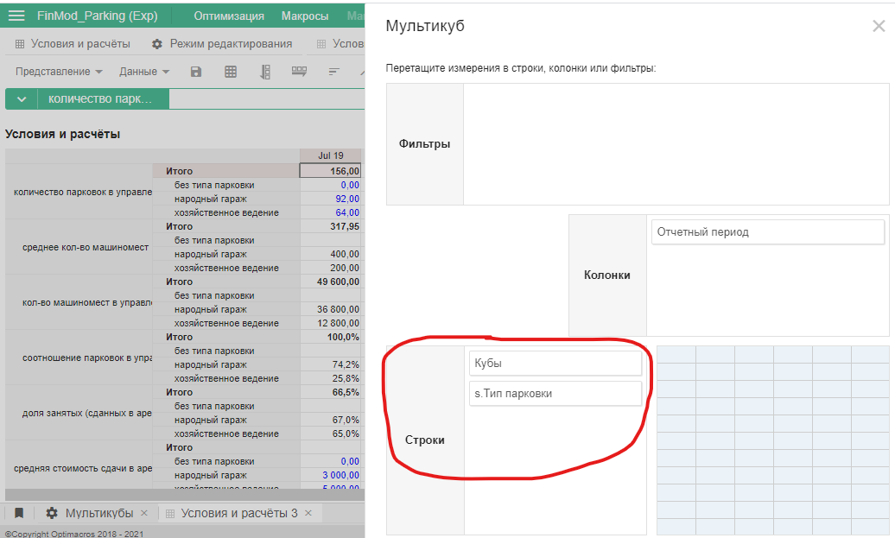
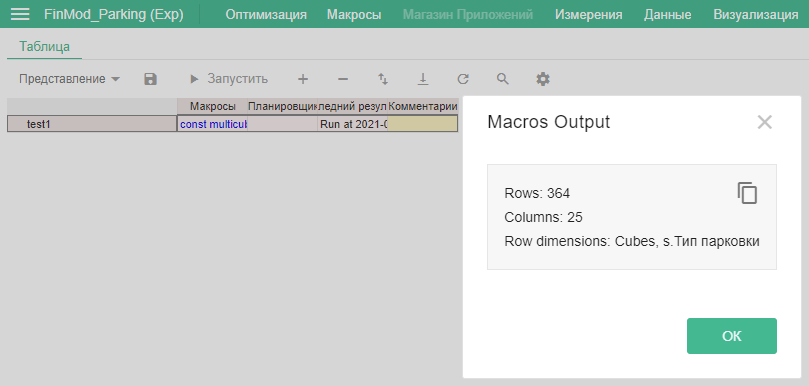
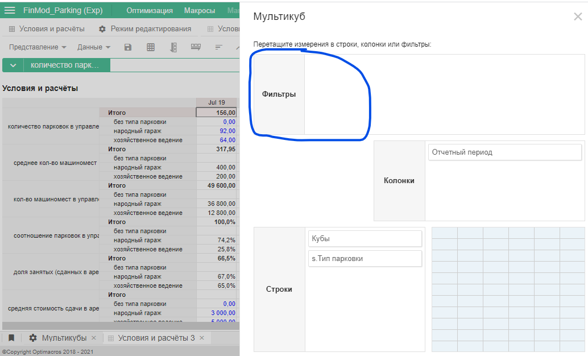
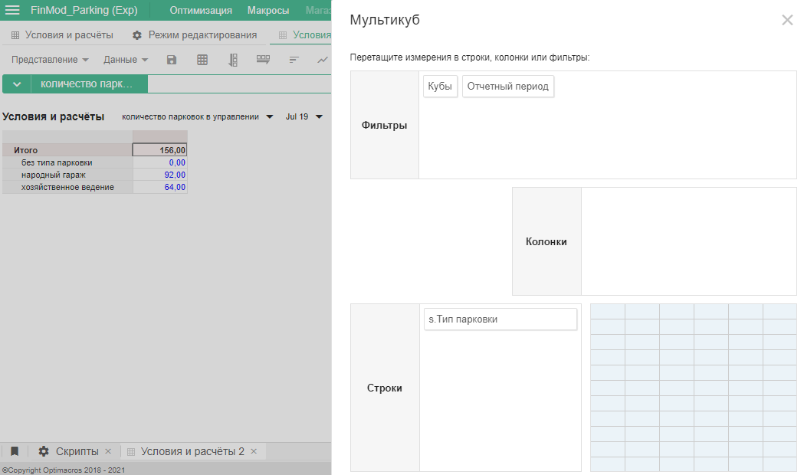
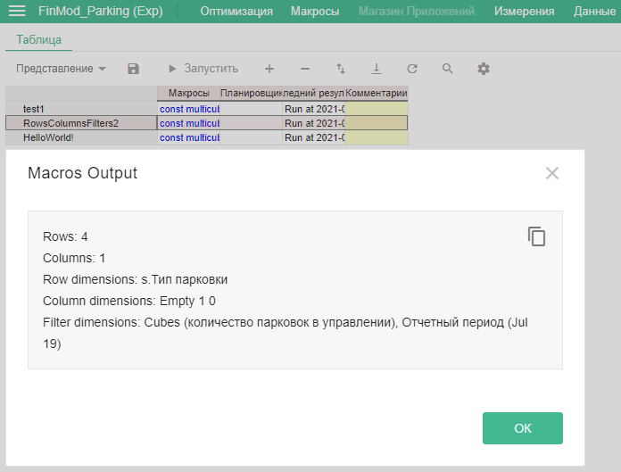

# Доступ к измерениям в строках, столбцах и фильтрах

Для выполнения этого задания понадобится тестовая модель и тестовый мультикуб, который нужно создать, если ваша модель пуста.

В этом упражнении в качестве примера будет использоваться модель `FinMod_Parking (Exp)`, работа будет вестись с мультикубом `Условия и расчёты`:


## Доступ к измерениям в строках

Сначала скрипту необходимо открыть мультикуб. Скрипт начинает свой путь с переменной [om](../API/API.md#OM), обращаясь к свойствам для углубления в модель. Для того, чтобы с помощью скрипта найти раздел `Данные` -> `Мультикубы`, мы используем интерфейс [Multicubes](../API/views.md#Multicubes). Для перехода в этот раздел необходимо вызвать функцию `multicubesTab()`. Сохраним результат в константу `multicubesTab`:

```js
const multicubesTab = om.multicubes.multicubesTab();
```

Таким образом, с помощью скрипта мы добрались до списка мультикубов модели. Теперь для того, чтобы выбрать интересующий нас мультикуб, необходимо вызвать функцию `open()` из интерфейса [MulticubesTab](../API/views.md#MulticubesTab) и в качестве аргумента указать имя мультикуба, с которым мы хотим работать. Сохраним открытый мультикуб в константу `multicubeTab`. Теперь код выглядит так:

```js
const multicubesTab = om.multicubes.multicubesTab();
const multicubeTab = multicubesTab.open('Условия и расчёты');
```

После того, как макрос открыл мультикуб, ему нужно понять, как именно расположить измерения, либо выбрать представление, в котором уже сохранено расположение измерений. Однако в скриптах 1.0 есть только [один способ](../appendix/constraints.md#pivot) получить доступ к представлению мультикуба.

Вызовем функцию `pivot()` из интерфейса [Tab](../API/views.md#Tab). Мы будем просматривать представление `Условия и расчёты 3`. Сохраним открытое представление в константу `pivot`:

```js
const pivot = multicubeTab.pivot('Условия и расчёты 3');
```
После того, как мы выбрали представление, следует обратиться к таблице с данными. Для этого используем функцию `create()` интерфейса [Pivot](../API/views.md#Pivot). Ссылку на таблицу сохраним в константу `grid`:

```js
const pivot = multicubeTab.pivot('Условия и расчёты 3');
const grid =  pivot.create();
```

Проверим работоспособность скрипта. Для этого выведем количество строк с помощью функции `rowCount()` интерфейса [Grid](../API/views.md#Grid):

```js
const multicubesTab = om.multicubes.multicubesTab();
const multicubeTab = multicubesTab.open('Условия и расчёты');

const pivot = multicubeTab.pivot('Условия и расчёты 3');
const grid =  pivot.create();

console.log(`Rows: ${grid.rowCount()} \n`);
```

Здесь стоит обратить внимание, что функция `console.log()` [не переносит курсор](../appendix/constraints.md#noLineBreak) на следующую строку, и это необходимо делать вручную.

Запустим скрипт для проверки работоспособности:


Теперь попробуем получить названия измерений, которые указаны в строках. Для начала сохраним информацию об измерениях в константу `definitionInfo` с помощью функции `getDefinitionInfo()`, вызванной на `grid`. И создадим константу `rowDimensionNames`, которую впоследствии заполним наименованиями измерений:

```js
const definitionInfo =  grid.getDefinitionInfo();
let rowDimensionNames = [];
```

Для того, чтобы просмотреть измерения, используемые в строках таблицы, нам нужно вызвать функцию `getRowDimensions()` интерфейса [GridDefinitionInfo](../API/views.md#GridDefinitionInfo). Эта функция обратится к измерениям на строках и вернёт их в виде массива (для нашей тестовой таблицы массив будет содержать два элемента: `Кубы`, `s.Тип парковки`):



Для перебора массива воспользуемся [forEach()](https://developer.mozilla.org/ru/docs/Web/JavaScript/Reference/Global_Objects/Array/forEach) с параметром `gridDimension`, в котором присвоим переменной `entity` результат работы функции.

Для того, чтобы в `entity` получить сущность [EntityInfo](../API/views.md#EntityInfo) измерения, вызовем функцию `getDimensionEntity()` интерфейса [GridDimension](../API/views.md#GridDimension). После чего добавим все названия измерений с помощью [push()](https://developer.mozilla.org/ru/docs/Web/JavaScript/Reference/Global_Objects/Array/push) в созданный нами ранее массив `rowDimensionNames`. Осталось лишь написать вывод информации о количестве измерений:

```js
const multicubesTab = om.multicubes.multicubesTab();
const multicubeTab = multicubesTab.open('Условия и расчёты');

const pivot = multicubeTab.pivot('Условия и расчёты 3');
const grid =  pivot.create();

console.log(`Rows: ${grid.rowCount()} \n`);
console.log(`Columns: ${grid.columnCount()} \n`);

const definitionInfo = grid.getDefinitionInfo();
let rowDimensionNames = [];
definitionInfo.getRowDimensions().forEach(gridDimension => {
    const entity = gridDimension.getDimensionEntity();
    rowDimensionNames.push(entity.name());
});

console.log(`Row dimensions: ${rowDimensionNames.join(', ')} \n`);
```
Запускаем скрипт:



## Доступ к измерениям в столбцах

Для того, чтобы получить названия измерений в столбцах, используется аналогичная механика. Оставим уже написаный выше скрипт и допишем пару строк.

Чтобы получить измерения в столбцах, воспользуемся функцией `getColumnDimensions()` интерфейса [GridDefinitionInfo](../API/views.md#GridDefinitionInfo):

```js
let columnDimensionNames = [];
definitionInfo.getColumnDimensions().forEach(gridDimension => {
    const entity = gridDimension.getDimensionEntity();
    columnDimensionNames.push(entity.name());
});
```

Добавим вывод `columnDimensionNames`, и тогда скрипт примет следующий вид:

```js
const multicubesTab = om.multicubes.multicubesTab();
const multicubeTab = multicubesTab.open('Условия и расчёты');

const pivot = multicubeTab.pivot('Условия и расчёты 3');
const grid =  pivot.create();

console.log(`Rows: ${grid.rowCount()} \n`);
console.log(`Columns: ${grid.columnCount()} \n`);

const definitionInfo =  grid.getDefinitionInfo();
let rowDimensionNames = [];
definitionInfo.getRowDimensions().forEach(gridDimension => {
    const entity = gridDimension.getDimensionEntity();
    rowDimensionNames.push(entity.name());
});

console.log(`Row dimensions: ${rowDimensionNames.join(', ')} \n`);

let columnDimensionNames = [];
definitionInfo.getColumnDimensions().forEach(gridDimension => {
    const entity = gridDimension.getDimensionEntity();
    columnDimensionNames.push(entity.name());
});

console.log(`Column dimensions: ${columnDimensionNames.join(', ')} \n`);
```

Результат работы скрипта:


## Доступ к измерениям в фильтрах

Чтобы получить доступ к измерениям в фильтрах, необходимо использовать немного усложнённую механику. Создаём массив `pageSelectedNames`. Для получения интерфейса с данными об измерениях в фильтрах представления вызываем функцию `getPageSelectors()` интерфейса [GridDefinitionInfo](../API/views.md#GridDefinitionInfo):

```js
let pageSelectedNames = [];
definitionInfo.getPageSelectors().forEach(pageSelector => {
    const dimensionEntity = pageSelector.getDimensionEntity();
});
```
А теперь отличие от двух предыдущих пунктов. Помимо наименований измерений в фильтрах, необходимо также получить информацию о выбранном элементе в фильтре. Для этого используется функция `getSelectedEntity()` (интерфейс [GridPageSelector](../API/views.md#GridPageSelector)):

```js
let pageSelectedNames = [];
definitionInfo.getPageSelectors().forEach(pageSelector => {
    const dimensionEntity = pageSelector.getDimensionEntity();
    const selectedEntity = pageSelector.getSelectedEntity();
});
```

Далее мы будем добавлять информацию по каждому измерению и выбранному элементу в этом измерении в массив `pageSelectedNames`:

```js
const pageSelectedNames = [];
definitionInfo.getPageSelectors().forEach(pageSelector => {
    const dimensionEntity = pageSelector.getDimensionEntity();
    const selectedEntity = pageSelector.getSelectedEntity();
    pageSelectedNames.push(`${dimensionEntity.name()} (${selectedEntity.name()})`);
});
```

Добавим строку с выводом `pageSelectedNames`, и в итоге скрипт будет выглядеть так:

```js
const multicubesTab = om.multicubes.multicubesTab();
const multicubeTab = multicubesTab.open('Условия и расчёты');

const pivot = multicubeTab.pivot('Условия и расчёты 3');
const grid = pivot.create();

console.log(`Rows: ${grid.rowCount()} \n`);
console.log(`Columns: ${grid.columnCount()} \n`);

const definitionInfo =  grid.getDefinitionInfo();
const rowDimensionNames = [];
definitionInfo.getRowDimensions().forEach(gridDimension => {
    const entity = gridDimension.getDimensionEntity();
    rowDimensionNames.push(entity.name());
});

console.log(`Row dimensions: ${rowDimensionNames.join(', ')} \n`);

const columnDimensionNames = [];
definitionInfo.getColumnDimensions().forEach(gridDimension => {
    const entity = gridDimension.getDimensionEntity();
    columnDimensionNames.push(entity.name());
});

console.log(`Column dimensions: ${columnDimensionNames.join(', ')} \n`);

const pageSelectedNames = [];
definitionInfo.getPageSelectors().forEach(pageSelector => {
    const dimensionEntity = pageSelector.getDimensionEntity();
    const selectedEntity = pageSelector.getSelectedEntity();
    pageSelectedNames.push(`${dimensionEntity.name()} (${selectedEntity.name()})`);
});

console.log(`Filter dimensions: ${pageSelectedNames.join(', ')} \n`);
```

Результат работы скрипта:


Вроде всё сделали верно, но почему после `Filter dimensions:` пустота? Потому что в фильтрах на этом представлении нет измерений, следовательно, скрипт выводит пустой массив:



Теперь запустим скрипт на представлении, в котором есть измерения в фильтрах. В качестве тестового измерения использовалось представление `Условия и расчёты 2`:



В результате данные в `Filter dimensions` появились:



Заметим, что на столбцах появилось измерение `'Empty 1 0'`, хотя на представлении измерений на столбцах нет. Подробнее про это можно прочитать [здесь](../appendix/constraints.md#flatTable).

[Курс молодого бойца](cookBook.md)

[Оглавление](../README.md)

